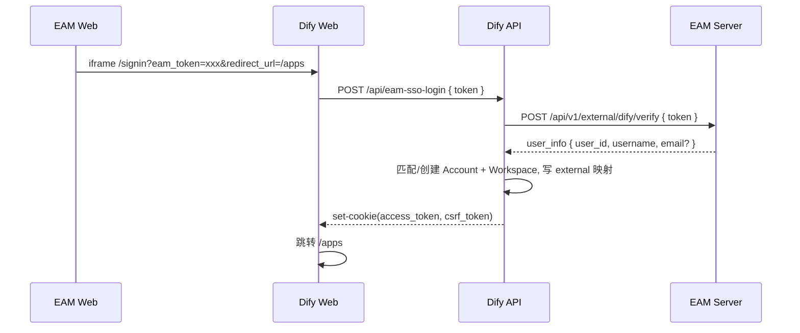

# EAM → Dify 单点登录集成（当前方案）

## 概述

目标：EAM 页面内嵌 Dify（iframe），用户在 EAM 登录后无感登录 Dify Console（/apps）。

链路：EAM Web → Dify Web `/signin?eam_token=...` → Dify API `/api/eam-sso-login` → EAM Server `/api/v1/external/dify/verify` → 创建/匹配 Dify Account → 颁发 Console 登录 Cookie（access_token + csrf_token）。

## 实现文件

### 1. Dify Web `/signin`
- 检测 `eam_token`，调用 Dify API 完成 SSO，设置 Cookie，跳转 `/apps`

### 2. Dify API (`dify/api/controllers/web/eam_sso_login.py`)
- 校验 EAM token（`EAM_VERIFY_URL`）
- 通过 external 映射优先按 `external_user_id` 匹配 `Account`；回退 `{user_id}@eam.user`；再回退真实邮箱
- 新用户自动创建默认 Workspace（Tenant + TenantAccountJoin owner）
- 颁发 Console token + CSRF，并写入 Cookie

### 3. 配置文件 (`dify/docker/env.local`)
- 添加了 `EAM_VERIFY_URL` 环境变量配置

## 工作流程



## 配置说明

### 环境变量
```bash
# EAM集成配置
EAM_VERIFY_URL=http://10.8.8.2:8000/api/v1/external/dify/verify
# 可选：调试开关
DIFY_DEBUG_AUTH=false
```

### EAM Server接口
需要提供以下接口供Dify调用：
- **URL**: `/api/v1/external/dify/verify`
- **Method**: POST
- **Body**: `{"token": "jwt_token"}`
- **Response**: `{"user_id": 123, "username": "user", "email": "user@example.com"}`

## 使用方法

### 1. 启动Dify服务
```bash
cd dify
docker-compose up -d
```

### 2. 配置EAM Server
确保EAM Server的验证接口可访问，并返回正确的用户信息格式。

### 3. 测试外部登录
```bash
# 使用测试脚本
python test_external_login.py

# 或直接访问（iframe 目标）
http://10.8.8.2:8080/signin?eam_token=your_eam_token&redirect_url=/apps
```

## 关键特性

1. **自动账号创建**: 首次登录自动创建 `Account` + Workspace（owner）
2. **稳定身份映射**: external 表优先按 `external_user_id` 匹配，邮箱可变更
3. **令牌验证**: 通过EAM Server验证JWT令牌
4. **无缝跳转**: 登录成功后自动跳转到目标页面

## 注意事项

1. 需要确保EAM Server的验证接口可访问
2. 需要配置正确的app_id
3. 需要确保Dify的webapp_auth功能已启用
4. 建议在生产环境中使用HTTPS

## 下一步

1. 在EAM Web中修改DifyFrame组件，使用新的auth页面
2. 测试完整的登录流程
3. 配置生产环境参数

